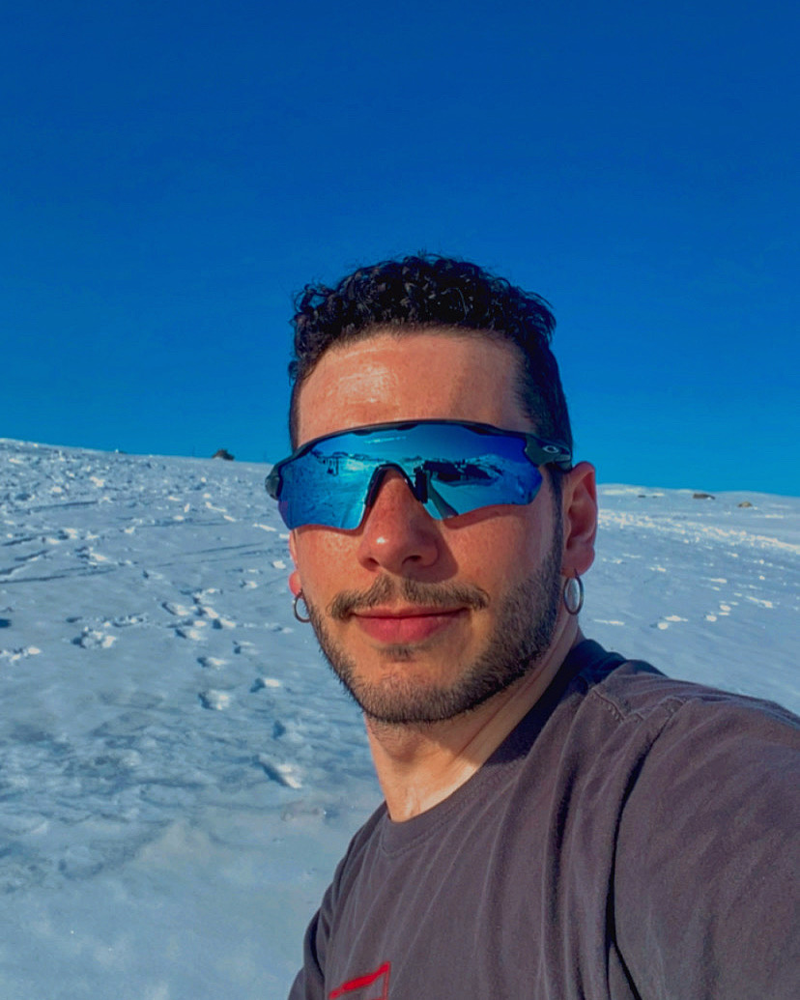

::: {.about-grid}
{.profile-image}

::: {.text-box}
## Olá!

I am an early-career researcher at the University of Bergen, Norway and part of the Mountains in Motion research lab. I completed a master's degree in Quaternary Geology and Paleoclimate at the University of Bergen with an ERASMUS at the Charles University, and a bachelor's degree in Geography at the University of São Paulo, Brazil. My research focuses on global cryosphere dynamics, with particular emphasis on mountain glacier systems during the Late Quaternary. My work integrates numerical modelling, remote sensing, geographic information systems, and AI-based tools to reconstruct glacier geometry and dynamics, with a strong emphasis on open science and interdisciplinarity.

Currently, I have been extending my insterests into global change ecology and biogeography, as I have been collaborating in projects related to vegetation map and species indentification with remote sensing and modelling of treeline changes and biogeographic shifts. Additionally, I have been co-developing a higher education course, ECO-SPACE, with aiming of increase geospatial competence within the biological sciences. Finally, I am the main coordinator of the GeoBridge Community, a hub for connecting GIS and Remote Sensing researchers from different career stages and for sharing knowledge in a collaborative platform. 
:::
:::
