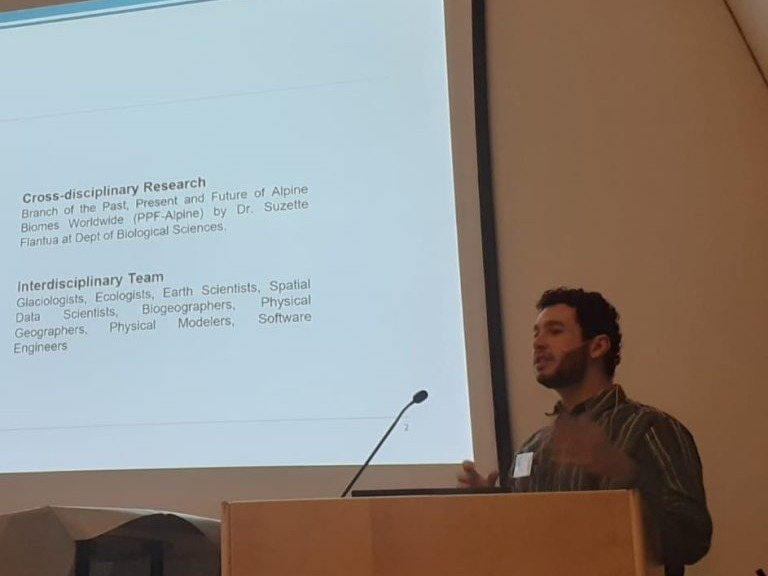
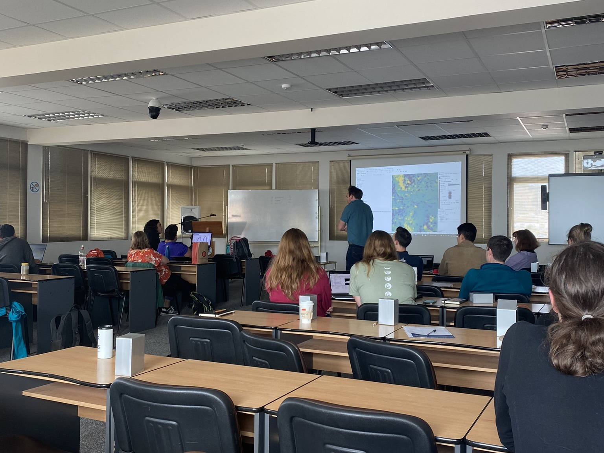
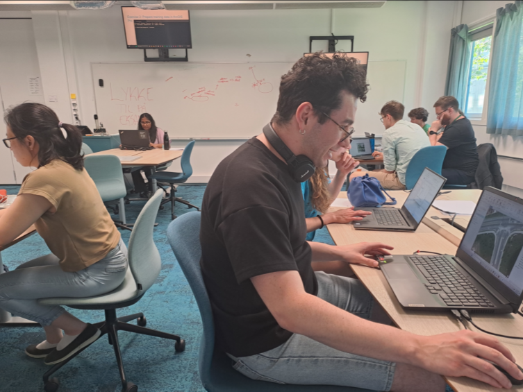
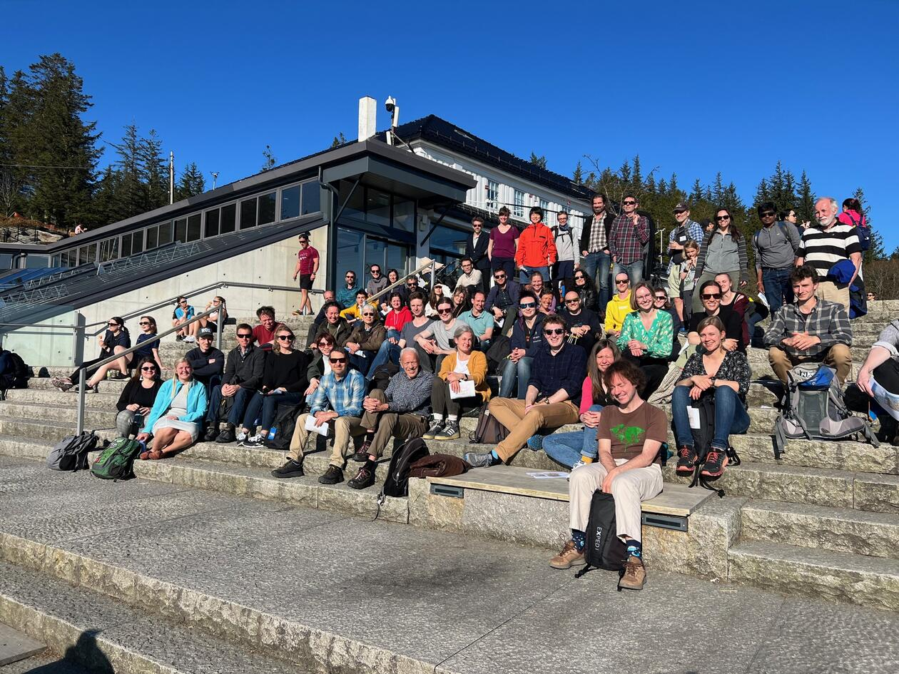
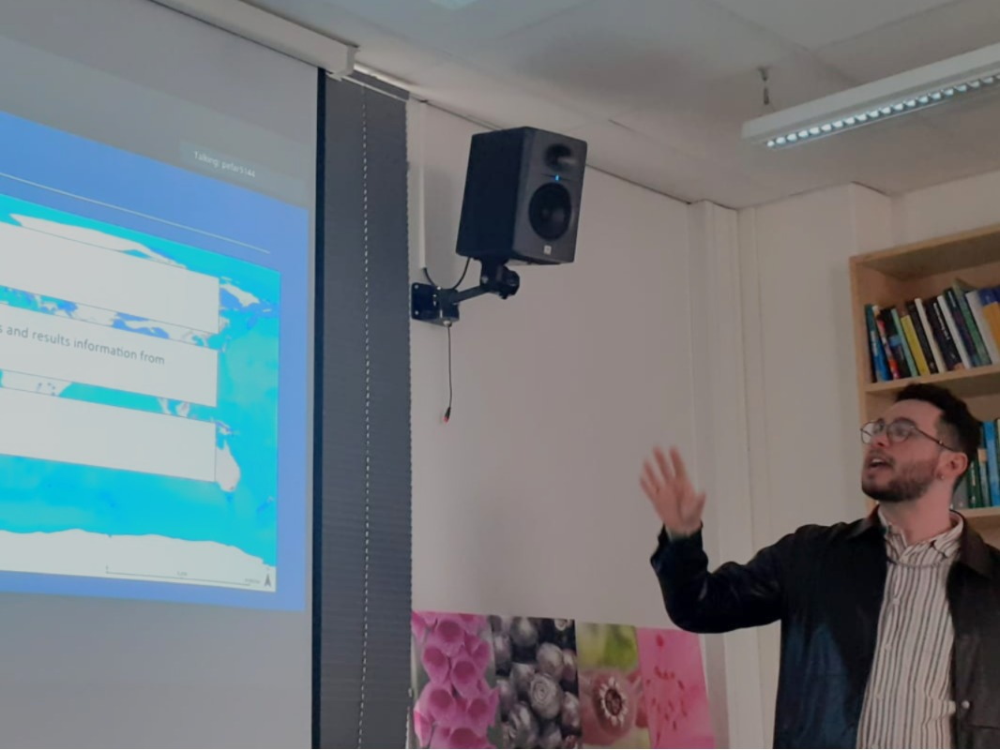

# 🏅 Grants

::: {.card}
#### HK-DIR Universell utforming i høyere utdanning 2025

I am the co-developer of the project [ECO-SPACE: Geospatial Competence and Education in Biosciences](https://sflantua.github.io/projects/ECO-SPACE/), which was awarded the HK-DIR Universell utforming i høyere utdanning grant (NOK 175,000) in 2025. This funding supports the development of geospatial training materials and educational resources for bioscience students and researchers, with a focus on enhancing spatial data literacy and competence in addressing ecological and environmental challenges.
:::

::: {.card}
#### Student4Student Summerschool

This grant covered the full registration fee (€450) for my participation
in the Mountain Research Initiative's Student4Student Summer School in Innsbruck.
:::

::: {.card}
#### European Geosciences Union 2025 (EGU25) General Assembly

I was awarded an EGU25 grant that included a full registration waiver
(€525) and an additional €500 in travel support to attend the European
Geosciences Union General Assembly in Vienna.
:::

::: {.card}
#### ERASMUS+ Scholarship

I received an ERASMUS+ scholarship (€3,180) that provided financial support for my exchange semester at Charles University in Prague.
:::

::: {.card}
#### AUSPIN Entrepreneurship Scholarship

I received the AUSPIN Entrepreneurship Scholarship (BRL 40,000) from the University of São Paulo, Brazil that provided financial support for my exchange year for career development at the University of Bergen.
:::

# 🌍 Conferences

::: {.card}
#### European Geosciences Union 2026 (EGU26)
Viena, Austria

At the [EGU26 General Assembly](https://www.egu26.eu/), I gave an <b>oral presentation</b> about the [“ECO-SPACE: Geospatial Competence and Education in Biosciences”](https://meetingorganizer.copernicus.org/EGU26/EGU26-21271.html) project. There, I highlighted the initiative’s focus on developing geospatial skills among bioscience students and researchers, emphasizing the importance of spatial data literacy in addressing ecological and environmental challenges. The presentation also showcased the project’s interdisciplinary approach, which combines geoinformatics, ecology, and education to foster a new generation of scientists equipped to analyze spatial patterns in biodiversity and ecosystem dynamics.
:::

::: {.card}
#### European Geosciences Union 2026 (EGU26)
Viena, Austria

I delivered an <b>oral presentation</b> on [“Validation Practices in Mountain Paleoglacier Modelling”](https://meetingorganizer.copernicus.org/EGU26/EGU26-19769.html)
at the [EGU26 General Assembly](https://www.egu26.eu/), where I reviewed how mountain paleoglacier modelling has been performed globally across decades of research. Moreover, I identified current gaps in the field and propose future pathways for modelling and modellers, with special emphazis on validation methodologies.
:::

::: {.card}
#### European Geosciences Union 2026 (EGU26)
Viena, Austria

Our manuscript ["Mountain glacier evolution since the last interglacial"](https://www.egu26.eu/EGU26-18020.html) were presented at the [EGU26 General Assembly](https://www.egu26.eu/) by Sjur Barndon. The <b>poster presentation</b> showcased the 130,000-year history of mountain glacier evolution since the last interglacial, highlighting regional patterns and drivers of glacial variability in eight different mountain ranges.
:::

::: {.card}
#### BIO Early Career Community Conference 2025
Bergen, Norway

I presented a <b>poster</b> on the ECO-SPACE project at the [BIO Early Career Community Conference](https://bionytt.w.uib.no/en/2025/09/12/save-the-date-and-register-for-bio-early-career-conference-1-december/) in Bergen. The poster highlighted the initiative’s focus on developing geospatial skills among bioscience students and researchers, emphasizing the importance of spatial data literacy in addressing ecological and environmental challenges.
:::

::: {.card}
#### European Geosciences Union 2025 (EGU25)
Viena, Austria

I delivered an <b>oral presentation</b> on the [“Global
geodatabase of mountain glacier extents at the Last Glacial
Maximum”](https://meetingorganizer.copernicus.org/EGU25/EGU25-20104.html)
at the [EGU25 General Assembly](https://www.egu25.eu/). As the first
author and presenter, I highlighted our synthesis of glacier
reconstructions from over 219 studies, exploring their applications in
paleoclimate analysis, species distribution modelling, and glacier
models validation. This presentation aims to foster dialogue on the role
of curated spatial data in advancing our understanding of Quaternary
climate variability and mountain landscape evolution.
:::

::: {.card}
#### Bjerknes Annual Meeting 2025
Bergen, Norway

At the [Bjerknes Annual
Meeting](https://bjerknes.uib.no/kalender/bjerknes-annual-meeting), I
gave an <b>oral presentation</b> on my ongoing work on paleoglaciers and their relevance to
present-day mountain ecosystem dynamics. The event gathered members of
the Bjerknes Centre for Climate Research, fostering exchanges between
Earth system scientists across disciplines. I received valuable feedback
from keynote guest [Dr. Erika
Coppola](https://bjerknes.uib.no/en/news/meet-our-new-sac-member-erika-coppola),
particularly on integrating paleodata into climate model validation
efforts.

:::

::: {.card}
#### European Geosciences Union 2024 (EGU24)
Viena, Austria

Although I did not attend the [EGU24 General
Assembly](https://www.egu24.eu/), I was proud to contribute to the
abstract [“Monitoring the physical processes driving the mass loss of
Tapado Glacier, Desert Andes of
Chile”](https://meetingorganizer.copernicus.org/EGU24/EGU24-13473.html),
presented by Prof. Álvaro Ayala. The manuscript incorporated key
findings from my master’s thesis, which focused on the glaciological
dynamics of Tapado Glacier. This contribution reflects the broader
relevance of my research in understanding contemporary glacier change in
high mountain environments.
:::

# 🏫 Summer Schools & Study Exchange

::: {.card}
#### Research Stay at the IBED, University of Amsterdam
Amsterdam, Netherlands 2025

I undertook a week-long research stay at the [Institute for Biodiversity and Ecosystem Dynamics](https://ibed.uva.nl/) (IBED) at the University of Amsterdam. During this visit, I met several collaborators and discussed ongoing work on the ECO-SPACE project, GeoBridge project and Drone-Willow-Bumblebee project. There we discussed the development of geospatial training materials for bioscience students and researchers, as well as potential applications of spatial data in biodiversity and ecosystem research. The visit also provided an opportunity to explore the IBED’s facilities and resources, fostering future collaboration on geospatial education initiatives.
:::

::: {.card}
#### Student4Student Summer School
Innsbruck, Austria 2025

I participated in the [Student4Student Summer School
(S4SS)](https://imc2025.info/summerschool/) as a grant-supported
attendee and presenter. The GLACIMONTIS project was selected for
inclusion in the session [FS 3.509: Do we model what we
measure?](https://imc2025.info/summerschool/s4sss25/sessions/do-we-model-what-we-measure/),
which focuses on bridging empirical data and modeling practices in
mountain research. I presented ongoing work on spatial uncertainty in
paleoglacier reconstructions and discuss how GLACIMONTIS can be used to
test and refine glaciological models. The summer school provided a
unique space for peer-to-peer learning, interdisciplinary exchange, and
critical reflection on the tools we use to understand past environmental
change.
:::

::: {.card}
#### International Summer School (Chile)
La Serena, Chile 2022

I took part in an 11-day international summer school organized around
[Tapado
Glacier](https://storymaps.arcgis.com/stories/e956b861bd604e898312537c755df471),
focusing on the application of Unmanned Aerial Vehicles (UAVs) in
cryosphere and landscape research. Through field-based training, data
acquisition, and analysis workshops, I gained hands-on experience in UAV
operations, structure-from-motion photogrammetry, and digital elevation
model generation. The program also emphasized collaborative research and
included site-specific discussions on glacier-climate interactions in
the high-altitude Andes. This training directly supported the
methodological foundation of my master’s thesis and strengthened ties
between researchers from South America and Europe.

:::

::: {.card}
#### Erasmus+ Exchange at Charles University
Prague, Czech Republic 2022-2023

As part of my master’s studies, I took part in an Erasmus+ exchange at
Charles University in Prague. During the semester, I focused on the
application of Geographic Information Systems (GIS) and Remote Sensing
(RS) in environmental and urban analysis. The experience allowed me to
engage with interdisciplinary coursework and deepen my technical skills
in spatial data processing, urban land cover classification, and
satellite image interpretation. Studying in an international academic
setting also broadened my perspective on how geospatial technologies are
used in sustainable urban planning and landscape management across
Europe.
:::

::: {.card}
#### Bachelor Exchange at the University of Bergen (UiB)
Bergen, Norway 2021-2022

During my undergraduate studies in Geography, I spent one academic year
at the University of Bergen through a bilateral exchange program. My
coursework focused on Quaternary geomorphology, cryosphere dynamics, and
advanced GIS and Remote Sensing techniques. This period was formative in
shaping my interest in long-term environmental change and mountain
glaciation, as I gained hands-on experience with spatial data analysis,
landform mapping, and proxy-based climate interpretation. The exchange
also marked my first academic involvement in cryospheric science and
laid the foundation for my ongoing focus on glacial and
paleoenvironmental research in high-mountain regions.
:::

# 🛠️ Workshops

::: {.card}
#### StoryMaps Workshop in ArcGIS
Bergen, Norway 2026

I organized and attended the [StoryMaps Workshop in ArcGIS](https://mountains-in-motion.github.io/geobridge/storymaps.html) at the University of Bergen in collaboration with the University of Amsterdam as part of the GeoBridge Project. The workshop provided training on using Esri’s StoryMaps platform to create interactive, web-based narratives that integrate maps, multimedia, and text. Participants learned how to design compelling stories that communicate complex geospatial information effectively. This skill is particularly valuable for disseminating research findings to both academic and public audiences, enhancing the impact of geospatial data in environmental communication.
:::

::: {.card}
#### Workshop on UAV and Remote Sensing Applications in Mountain Environments
Bergen, Norway 2025

I organized and attended the [Workshop on UAV and Remote Sensing Applications in Mountain Environments](https://mountains-in-motion.github.io/geobridge/uavworkshop.html) as part of the GeoBridge Project. The workshop consisted of hands-on fieldwork training in UAV operations, data acquisition, and processing techniques relevant to mountain research. Participants learned how to use drones for vegetation mapping and monitoring mountain landscapes. The workshop outputs was later integrated into the Drone-Willow-Bumblebee project.
:::

::: {.card}
#### Introduction to peer teaching for teaching assistants and group leaders
Bergen, Norway 2025

I attended the [MNPED101 - Introduction to peer teaching for teaching assistants and group leaders](https://www4.uib.no/en/studies/courses/mnped101) course at the University of Bergen, which provided foundational training in pedagogical techniques for effective peer teaching. The course covered topics such as lesson planning, student engagement strategies, and assessment methods. This training enhanced my ability to support undergraduate students in their learning process, particularly in courses related to GIS, Remote Sensing, and Quaternary science. It also prepared me for future roles in academic mentorship and teaching.
:::

::: {.card}
#### Geospatial Artificial Intelligence Workshop
Bergen, Norway 2024

I attended the [Geospatial Artificial Intelligence
Workshop](https://www.iearth.no/feed/geospatial-artificial-intelligence-workshop-23-24th-of-may),
a two-day event co-organized by Geodata, iEarth, and the University of
Bergen. The workshop explored the integration of deep learning
algorithms in geospatial workflows, with a focus on remote sensing image
classification. Through hands-on exercises and expert-led sessions, I
deepened my understanding of convolutional neural networks and their
applications to Earth observation data. This experience strengthened my
ability to evaluate AI tools for cryosphere studies and opened pathways
for future work at the intersection of geoinformatics and environmental
change.

:::

::: {.card}
#### International Workshop on Greenland Ice Sheet
Bergen, Norway 2023

I volunteered as an assistant for the [International Workshop on the
Greenland Ice
Sheet](https://www.uib.no/en/rg/quaternary/162213/international-workshop-greenland-ice-sheet),
which brought together scientists to share recent advances in Greenland
ice sheet dynamics and their implications for climate change and
sea-level rise. My role included logistical and technical support
throughout the event. This workshop provided me with a broader context
for academic event management and organization.

:::

# 🎤 Talks

::: {.card}
#### Western US Paleoglaciers Working Group – Speaker Series
Online 2026

I was invited to speak in the 2026 Winter Speaker Series of the Western
[US Paleoglaciers Working Group](https://paleoglaciers.org/). My presentation focused on our manuscript on mountain glacier evolution since the last interglacial, which is in peer-review but with a [pre-print version available](https://zenodo.org/records/18195704). I highlighted the synthesis of 130,000 years of glacier history across eight mountain ranges, emphasizing regional patterns and drivers of glacial variability. The talk also discussed the implications of these findings for understanding past climate change and informing future glacier projections.

<a href="https://www.youtube.com/watch?v=VKOkRKNXtNo"
class="btn btn-primary mt-2" target="_blank">🎥 Watch the talk here!</a>
:::

::: {.card}
#### Lunch Talk – Ecological and Environmental Change Research Group
Bergen, Norway 2025

I delivered a departmental Lunch Talk to the Ecological and
Environmental Change Research Group, where I presented ongoing work from
the GLACIMONTIS project. My presentation focused on the global
geodatabase of mountain glacier extents during the Last Glacial Maximum
and its implications for paleoecological reconstructions. I discussed
the database’s role in identifying glacial refugia and informing species
distribution models in mountainous environments. The talk encouraged
interdisciplinary discussion among geographers, ecologists, and
paleoclimatologists, strengthening local interest in cross-scalar
Quaternary research.

:::

::: {.card}
#### Western US Paleoglaciers Working Group – Speaker Series
Online 2025

I was invited to speak in the 2025 Winter Speaker Series of the Western
US Paleoglaciers Working Group. My presentation focused on the
methodology and results of the GLACIMONTIS initiative, emphasizing
global patterns in paleoglacier extent and the challenges of harmonizing
spatial data from diverse reconstructions. I also shared preliminary
findings on mountain glacier variability across regions and discussed
future directions in open-access paleodata publishing.

<a href="https://www.youtube.com/watch?v=cX87fKqr_yg"
class="btn btn-primary mt-2" target="_blank">🎥 Watch the talk here!</a>
:::

::: {.card}
#### Lunch Talk – Ecological and Environmental Change Group
Bergen, Norway 2024

I presented a departmental Lunch Talk to the Ecological and
Environmental Change Research Group, focusing on literature review
strategies and the accessibility of paleoclimate data. I shared my
experiences with systematic database compilation and discussed tools for
improving reproducibility and transparency in geoscientific synthesis
work.
:::

::: {.card}
#### XVI Colóquio de Estudantes de Pós-graduação da USP
Sao Paulo, Brazil 2023

I presented my master’s thesis at the *XVI Colóquio de Estudantes de
Pós-graduação* at the University of São Paulo (USP), where I discussed
glacial dynamics at Tapado Glacier and the development of a field-based
monitoring strategy. The event fostered interdisciplinary exchange and
provided a platform for emerging research across Brazilian graduate
programs. My talk also highlighted the collaboration between USP and the
University of Bergen (UiB), strengthening international academic ties.
:::

::: {.card}
#### GIS/Remote Sensing Workshop Group Get-Together
Bergen, Norway 2023

During a departmental gathering of the GIS and Remote Sensing Workshop
Group, I presented results and methods from my master’s thesis on
glacial melt processes at Tapado Glacier, Chile. The event brought
together researchers and students interested in spatial technologies,
facilitating discussions on UAV data processing, DEM accuracy, and
landscape change detection. My contribution helped demonstrate the
applicability of remote sensing methods in high-mountain environments
under climate stress.
:::

::: {.card}
#### Panorama Atual dos Projetos de Pesquisa Integrados (USP/UNIR)
Sao Paulo, Brazil 2022

I presented my master’s thesis project at the event *Panorama Atual dos
Projetos de Pesquisa Integrados*, which focused on the progress of
collaborative initiatives between the University of São Paulo (USP) and
the Federal University of Rondônia (UNIR). My talk emphasized the value
of international research collaboration, highlighting fieldwork in the
Chilean Andes and my joint academic affiliation with the University of
Bergen (UiB). The event served as a platform for interdisciplinary
dialogue and cross-institutional research planning in Brazil.
:::
