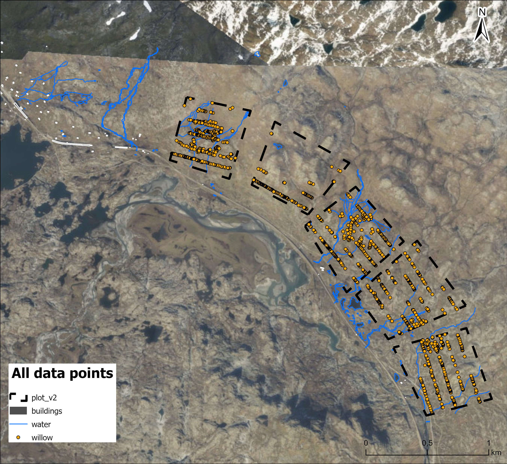
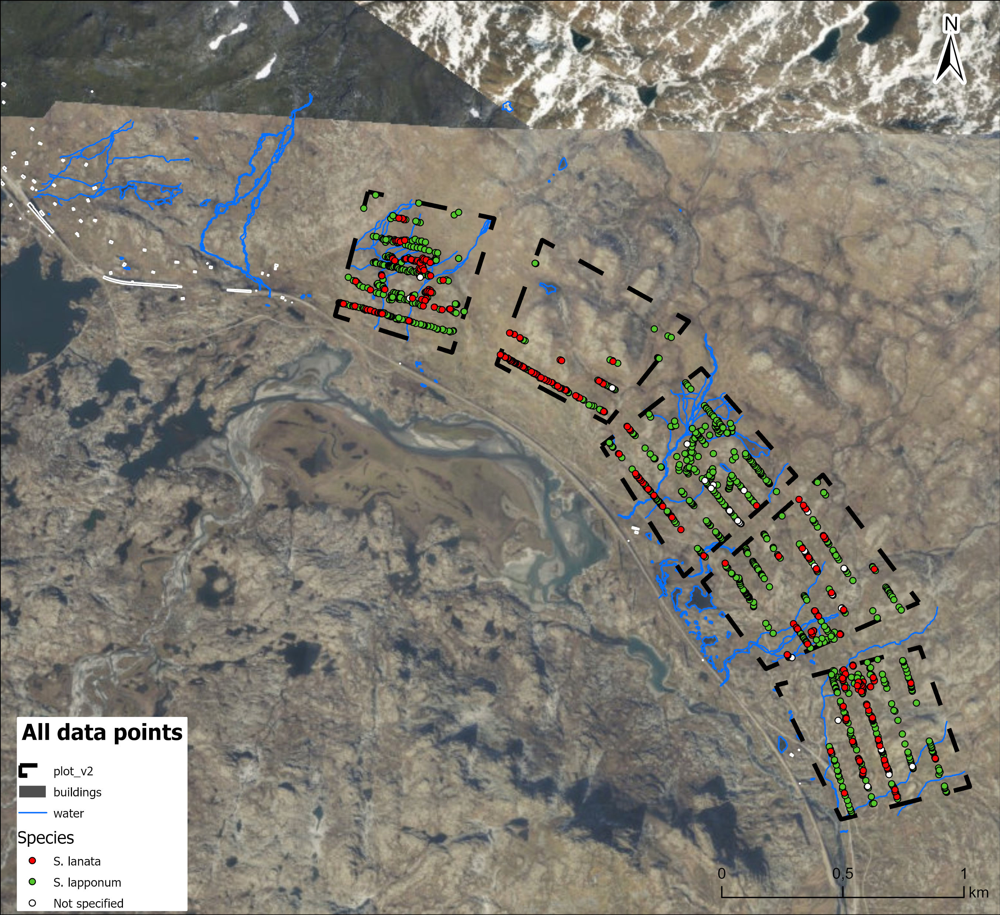
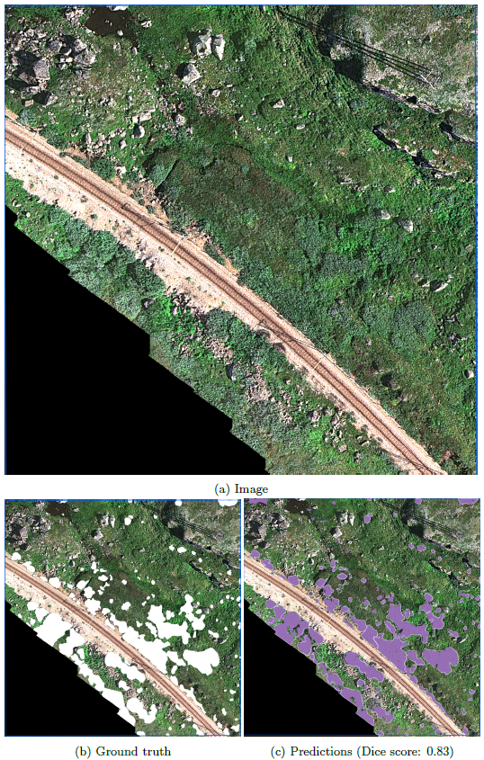

::: {.bumblebee-hero}

::: {.bumblebee-hero-inner}

::: {.bumblebee-hero-text}

Bumblebee Project

Mapping willow resources for pollinators in the alpine landscapes of Finse

The Bumblebee project combines field surveys, ArcGIS Field Maps, high-resolution drone imagery, and deep learning to map alpine willow shrubs around Finse. The broader goal is to understand where important willow resources occur in the landscape, how they can be monitored efficiently, and how their distribution may matter for bumblebees under environmental change.

::: {.button-row-dark}
[Project website](https://mountains-in-motion.github.io/drone-willow-bumblebee/){.btn .btn-light}
[Field Maps tutorial](https://ac-lima.github.io/fieldmaps/){.btn .btn-outline-light}
[Drone report](https://mountains-in-motion.github.io/drone-willow-bumblebee/finse-willow-report.html){.btn .btn-outline-light}
:::

:::

::: {.bumblebee-hero-image}
{.bumblebee-hero-map}
:::

:::
:::

::: {.bumblebee-stats}

::: {.bumblebee-stat-card}
### 1,521
mapped willow records
:::

::: {.bumblebee-stat-card}
### 5
field plots in the final map set
:::

::: {.bumblebee-stat-card}
### 3
covered drone survey zones
:::

::: {.bumblebee-stat-card}
### 4 cm
approximate drone image pixel resolution
:::

:::

::: {.bumblebee-section}

## Project idea {#project-idea}

In the mountains around Finse, willow shrubs form small but ecologically important patches in the alpine landscape. They provide floral and structural resources for pollinators, including bumblebees, and their spatial distribution may shift as climate and land-cover conditions change. This project explores how willow shrubs can be mapped from the ground and from the air, using field observations to support drone-based automatic detection.

The project focuses on the relationship between three components: **willows**, **bumblebees**, and **spatial monitoring**. Field teams mapped individual willow observations using mobile GIS; drone surveys captured high-resolution imagery over selected zones; and deep learning workflows were tested to automatically delineate willow patches from aerial images.

:::

::: {.two-column-section}

::: {.text-column}
## Why willows?

The field campaign focused on distinguishing willow species and reproductive traits in the field, especially *Salix lapponum* and *Salix lanata*. Each mapped observation recorded location, species, gender, flowering status, fruiting status, and photographs. These attributes help connect plant distribution, flowering resources, and potential pollinator habitat.
:::

::: {.text-column}
## Why drones and AI?

Walking every transect is slow, especially in remote alpine terrain. Drone imagery can capture broad areas at very high spatial resolution, while deep learning can turn those images into repeatable maps of willow cover. The field observations are therefore not only ecological data, but also training and validation information for automated mapping.
:::

:::

::: {.bumblebee-highlight}

## From field observations to operational mapping

The project is built around a practical question: **can we move from individual willow observations collected in the field to repeatable, larger-scale maps of willow cover?** The first field trips tested field protocols, species/gender identification, transect design, mobile data collection, and drone survey constraints. The drone-mapping workflow then tested whether manually mapped willows could support automatic segmentation of shrubs in unseen drone imagery.

::: {.bumblebee-image-block}
{.bumblebee-hero-map}
:::

:::

::: {.bumblebee-section}

## Field mapping workflow {#field-mapping}

The field component used an ArcGIS Online project and ArcGIS Field Maps to geotag willow observations directly in the field. The first field trip prepared a mobile sampling form with drop-down attributes for willow gender, willow species, flowering, fruiting, and photo attachments. The plots were organised using tentative plot boundaries and approximate 500 m grid cells to guide sampling areas.

::: {.workflow-grid}

::: {.workflow-card}
### 1. Prepare plots and sampling areas

Tentative plots and fishnet-style sampling areas were prepared before fieldwork. These helped orient the team in the field, even though final sampled areas were adjusted according to terrain, infrastructure, and accessibility.
:::

::: {.workflow-card}
### 2. Collect geotagged observations

Each willow observation was recorded in ArcGIS Field Maps. Location was assigned automatically by the phone GPS, and the observer filled in species, gender, flowering, fruiting, and photo information.
:::

::: {.workflow-card}
### 3. Walk transects

From the second plot onwards, team members followed approximate parallel transects, using live GPS tracking in the app. Transects were used to create more systematic sampling and to identify areas of both presence and true absence.
:::

::: {.workflow-card}
### 4. Review and improve

The first campaign revealed important lessons: GPS accuracy varies between phones, species and gender identification improved through field discussion, and future ground-truthing needs a more standardised photo and metadata protocol.
:::

:::

::: {.bumblebee-image-block}

:::

:::

::: {.bumblebee-section}

## What the final maps show {#final-maps}

The final map set summarises willow observations after two field campaigns in June and July 2025. Across all mapped points, the dataset contains 1,521 willow records. The species table in the overview map reports 1,221 *S. lapponum*, 266 *S. lanata*, and 34 records without species assignment. The gender table reports 673 female, 134 male, and 714 records without gender assignment. Flowering was recorded for 425 observations.

::: {.feature-list}

::: {.feature-item}
### Species distribution

The maps show that *S. lapponum* dominates the sampled records, while *S. lanata* occurs less frequently and is more spatially clustered in several plot-level maps.
:::

::: {.feature-item}
### Reproductive information

Gender and flowering attributes provide ecological information that may be relevant for pollinator resource availability, while also highlighting where uncertain or unspecified observations remain.
:::

::: {.feature-item}
### Plot-level heterogeneity

Plot-level maps reveal strong differences in willow density, species composition, and sampling coverage between plots, which is important for interpreting drone-based training and validation areas.
:::

::: {.feature-item}
### Infrastructure and field constraints

Powerlines, buildings, rivers, and terrain influenced where sampling and drone flights could safely occur. These constraints are part of the project design, not just logistical details.
:::

:::

::: {.bumblebee-section}

## Drone mapping and deep learning {#drone-mapping}

The drone component tested whether high-resolution imagery can be used to automatically detect willow shrubs. The drone survey covered three zones around Finse, together covering approximately 2,000,000 m². The Wingtra drone imagery was collected with a MicaSense RE-P multispectral camera and a spatial resolution of approximately 4 cm per pixel. Fine spatial detail is crucial because many willow patches are small, irregular, and mixed with rocks, grass, shadows, and other vegetation.

The automatic mapping workflow used manually interpreted field and image data to train semantic segmentation models. The best and most stable reported model was a DeepLabV3 model with a ResNet-50 backbone using 786 × 786 pixel image tiles. On unseen test areas, the model delineated willow patches with Dice scores of 0.83 and 0.88 in two shown examples, indicating strong potential for operational mapping after further refinement.

::: {.bumblebee-image-block}

:::

:::

::: {.bumblebee-section}

## My contribution {#my-contribution}

My contribution focused on connecting ecological field questions with practical geospatial workflows. I developed the ArcGIS Field Maps fieldwork methodology used for willow mapping in Finse, including the preparation of the digital field forms, map layers, sampling structure, and mobile data-collection workflow. I also participated in the field campaign, supported the coordination and supervision of field data collection, and processed the collected field data after the surveys.

In addition, I produced the final cartographic outputs showing willow distribution by species, gender, flowering status, and fruiting status across the study plots. These maps helped translate the field observations into spatial datasets that could support ecological interpretation and provide training and validation material for later drone-based analyses.

The project also connects directly to my broader work in geospatial education. The ArcGIS Field Maps tutorial I developed for beginners supports reproducible field-data collection workflows, including project preparation, mobile-app use, data synchronisation, and best practices for collecting georeferenced ecological observations in the field.

Beyond the field-mapping component, I assisted with the UAV/drone survey collection and have been collaborating on the supervised deep learning classification workflow used to detect and delineate willow cover from high-resolution drone imagery.

:::

::: {.bumblebee-section}

## Outputs and resources {#outputs}

::: {.resource-grid}

::: {.resource-card}
### Project website

The public Bumblebee website introduces the project, field gallery, drone report, willow identification guide, and team information.

[Open project website](https://mountains-in-motion.github.io/drone-willow-bumblebee/){.btn .btn-primary}
:::

::: {.resource-card}
### Field Maps tutorial

A beginner-friendly ArcGIS Field Maps tutorial covering installation, map preparation, field collection, synchronisation, and best practices.

[Open tutorial](https://ac-lima.github.io/fieldmaps/){.btn .btn-primary}
:::

::: {.resource-card}
### Drone mapping report

Summary of the automatic willow-mapping workflow using Wingtra drone imagery and deep learning.

[Open drone report](https://mountains-in-motion.github.io/drone-willow-bumblebee/finse-willow-report.html){.btn .btn-primary}
:::

:::

:::

::: {.bumblebee-highlight}

## Why this project matters

The Bumblebee project is a small but powerful example of how field ecology, geospatial technologies, and artificial intelligence can work together. By mapping willow shrubs more efficiently, the project can support future research on alpine vegetation change, pollinator resources, and long-term ecological monitoring in mountain landscapes.

:::
