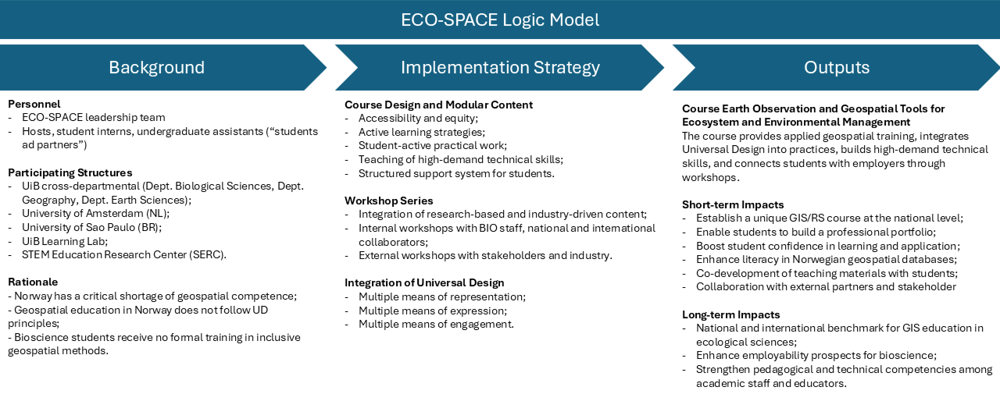

::: {.ecospace-hero}
::: {.ecospace-hero-text}
# ECO-SPACE

## Geospatial Competence and Education in Biosciences in Norway

ECO-SPACE develops inclusive, research-based geospatial education for biogeography, global change ecology and environmental management. The project brings together GIS, remote sensing, universal design, ecological case studies, and research- and industry-driven learning to prepare students to create spatial products that are scientifically robust, accessible, and useful beyond the university.

::: {.button-row-dark}
[Project structure](#project-structure){.btn .btn-light}
[Example modules](#example-modules){.btn .btn-outline-light}
:::
:::

::: {.ecospace-hero-logo}
{.ecospace-logo}
:::
:::

::: {.stats-grid .ecospace-stats}
::: {.stat-card}
### 25
Potential self-paced modules covering foundational and advanced GIS/RS topics.
:::

::: {.stat-card}
### BIO
Developed at the Department of Biological Sciences, University of Bergen in collaboration with the Department of Earth Sciences and the Department of Geography, University of Bergen and the Institute for Biodiversity and Ecosystem Dynamics, University of Amsterdam.
:::

::: {.stat-card}
### UD
Universal design integrated as both teaching practice and course content.
:::
:::

::: {.ecospace-section}
## Overview

How can biology and environmental science students learn geospatial skills in a way that is both technically strong and accessible to diverse users?

ECO-SPACE addresses this question by developing *Earth Observation and Geospatial Tools for Ecosystem and Environmental Management*, a new extra curricular module course at the Mountains in Motion Lab, Department of Biological Sciences, University of Bergen. The course responds to a growing need for spatial competence in environmental monitoring, biodiversity management, climate adaptation, land-use planning, and sustainable resource management.

The project is built around a simple idea: geospatial education should not only teach students how to analyse spatial data, but also how to develop spatial critical thinking and communicate spatial information in ways that are inclusive, understandable, and useful for society.
:::

::: {.two-column-section}
::: {.text-column}
## Why ECO-SPACE?

Spatial technologies are now central to environmental research and decision-making. They help us map biodiversity patterns, monitor vegetation change, assess human pressure on ecosystems, understand coastal and marine environments, and communicate complex environmental information to different audiences.

Yet students in biology and environmental sciences often have limited access to geospatial training designed around ecological questions. At the same time, maps, dashboards, models, and visualizations are not always designed with accessibility in mind.
:::

::: {.text-column}
## What makes it different?

ECO-SPACE combines two needs that are often treated separately: spatial competence and universal design. Students learn how to work with geospatial data, but also how to produce outputs that can be read, interpreted, and used by diverse audiences.

The course therefore treats accessibility not as an afterthought, but as part of professional geospatial competence.
:::
:::

::: {.ecospace-highlight}
## Inclusive geospatial education

The goal is not only to teach GIS and remote sensing. The goal is to train students to produce spatial analyses, maps, and digital products that are scientifically meaningful, visually clear, and accessible to diverse users.
:::

::: {.ecospace-section #project-structure}
## Project structure

:::

::: {.ecospace-section}
## Universal design as geospatial competence

ECO-SPACE treats universal design as more than an accessibility requirement. It is taught as a professional skill for future environmental researchers, consultants, planners, and data communicators.

In practice, this means that students learn to think about colour-safe and high-contrast map design, readable legends and captions, clear metadata, multiple content formats, flexible pacing, low-stakes assessments, and spatial communication for specialist and non-specialist audiences.
:::

::: {.ecospace-section #example-modules}
## Example modules

The course is being developed through a portfolio of practical modules that move from basic geospatial literacy to applied ecological analysis.
:::

::: {.ecospace-module-grid}
::: {.ecospace-module-card}
### Exploring the Islands of Europe

Students learn how to create an ArcGIS Pro project, work with vector and raster data, calculate island area, analyse distance to the mainland, summarize elevation and climate, and export a clear map layout.
:::

::: {.ecospace-module-card}
#### Beginner · QGIS
### Exploring Greenland

Students use QGIS and QGreenland to explore the west coast of Greenland, thick-billed murre colonies, sea-ice conditions, vector layers, raster layers, metadata, spatial patterns, and accessible map production.
:::

::: {.ecospace-module-card}
#### Intermediate · ArcGIS Pro
### Alpine Biome Under Pressure

Students analyse alpine biome definitions in High Mountain Asia using GMBA mountain units, elevation data, alpine biome maps, the Global Human Footprint Index, and protected-area datasets.
:::

::: {.ecospace-module-card}
#### Intermediate · Remote Sensing
### Shrub Encroachment Around Finse

Students work with satellite imagery to understand alpine vegetation change. The workflow includes band combinations, NDVI, supervised and unsupervised classification, accuracy assessment, and change detection.
:::
:::

<!-- Optional image block. Add a screenshot/collage to img/ecospace_modules.png and remove these comment markers.

::: {.ecospace-map}

:::

-->

::: {.ecospace-section}
## Project activities

ECO-SPACE is developed through three complementary activity streams.

Internal workshops with researchers at BIO-UiB support the development of research-based modules using departmental expertise and datasets. These workshops also strengthen geospatial capacity among staff and students.

External academic workshops connect ECO-SPACE to collaborators in geography, earth sciences, ecology, and geospatial education. This allows the course to reuse, adapt, and improve existing teaching materials while aligning them with ecological applications and universal design.

Stakeholder workshops with public and private actors help connect course content with real-world environmental challenges. These collaborations are intended to make the course more relevant for future workplaces and to generate practical case studies that students can use in project-based assignments.
:::

::: {.two-column-section}
::: {.text-column}
## My role

I contribute to ECO-SPACE as part of the leadership team and as a course developer. My work focuses on building GIS and remote sensing teaching materials, translating ecological and environmental questions into practical geospatial workflows, supporting accessible spatial communication, and helping design modules that students can follow independently.
:::

::: {.text-column}
## Connection to my work

This work builds directly on my background in geomatics, remote sensing, geospatial databases, glacier and vegetation monitoring, and interdisciplinary GIS education. ECO-SPACE also connects with my broader interest in making spatial methods more accessible to students and researchers working across ecology, biogeography, cryosphere science, and landscape change.
:::
:::

::: {.ecospace-section}
## Team and collaborators
:::

::: {.ecospace-people-grid}
::: {.ecospace-person-card}
### Leadership and course development

Suzette Flantua, Augusto Lima, Peter Manning, Sehoya Cotner, and Jonathan Soulé.
:::

::: {.ecospace-person-card}
### National collaborators

Benjamin Robson and Gidske Andersen contribute expertise in GIS, remote sensing, geomatics, and geospatial education at UiB.
:::

::: {.ecospace-person-card}
### International collaborators

Ligia Vizeu Barrozo, Harry Seijmonsbergen, Thijs de Boer, and partners from USP, UvA, and other institutions contribute international perspectives on applied GIS, remote sensing, and ecological modelling.
:::
:::

::: {.ecospace-highlight}
## Expected impact

ECO-SPACE aims to become a reusable and scalable model for inclusive geospatial education in ecology and environmental management. By developing modular teaching resources, the project can support students at UiB while also contributing to wider national and international teaching collaborations.

The long-term ambition is to help train environmental professionals who can analyse spatial data critically, communicate results clearly, and design geospatial products that are accessible to the people who need them.
:::

::: {.ecospace-section}
## Contact

For questions about ECO-SPACE or related geospatial education activities, please contact:

**Augusto Lima**  
Department of Biological Sciences, University of Bergen  
<augusto.naschimento@uib.no>

**Suzette Flantua**  
Department of Biological Sciences, University of Bergen
:::
