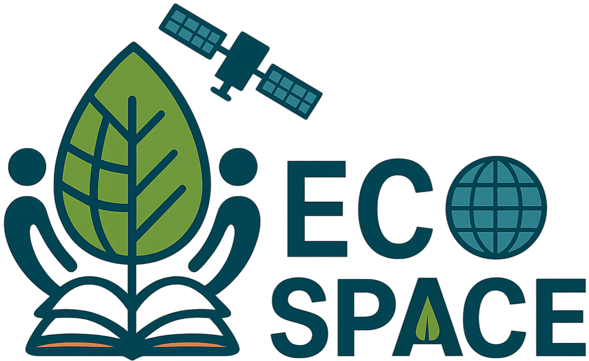
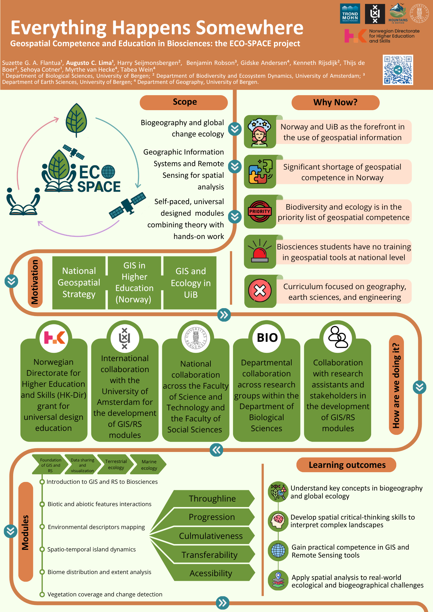

::: {.ecospace-hero}
::: {.ecospace-hero-text}

ECO-SPACE

Geospatial Competence and Education in Biosciences

ECO-SPACE is an extra-curricular bio-spatial education initiative at the University of Bergen. The project develops self-paced, universally designed learning modules that connect biogeography, global change ecology, GIS, and remote sensing through hands-on spatial analysis.

::: {.button-row-dark}
[Project idea](#project-idea){.btn .btn-light}
[Learning modules](#learning-modules){.btn .btn-outline-light}
[EGU26 abstract](https://meetingorganizer.copernicus.org/EGU26/EGU26-21271.html){.btn .btn-outline-light}
:::
:::

::: {.ecospace-hero-logo}
{.ecospace-logo}
:::
:::

::: {.stats-grid .ecospace-stats}
::: {.stat-card}
### Extra-curricular
A flexible learning space beyond formal ECTS structures.
:::

::: {.stat-card}
### GIS + RS
Hands-on training in Geographic Information Systems and Remote Sensing.
:::

::: {.stat-card}
### Bio-spatial
Ecological questions translated into spatial workflows.
:::

::: {.stat-card}
### Accessible
Universal design integrated into learning materials and map communication.
:::
:::

::: {.ecospace-section #project-idea}
## Project idea

ECO-SPACE — *Geospatial Competence and Education in Biosciences* — was created from a simple observation: biological and ecological processes are spatial, but biosciences students often have limited opportunities to learn geospatial tools through biological examples.

The project responds to this gap by developing an extra-curricular set of learning modules where students can build practical GIS and remote sensing skills while working with real ecological and environmental questions. Instead of treating GIS as a technical add-on, ECO-SPACE frames spatial analysis as part of ecological thinking: species distributions, island systems, alpine biomes, vegetation change, animal habitats, and climate–ecosystem interactions all happen somewhere.

The ambition is to make geospatial learning more accessible, transferable, and relevant for students and researchers in biosciences.
:::

::: {.two-column-section}
::: {.text-column}
## Why now?

GIS and remote sensing are now essential for biodiversity monitoring, ecological mapping, spatial planning, climate adaptation, and environmental management. Yet geospatial education in Norway is still largely concentrated in geography, earth sciences, and engineering.

ECO-SPACE addresses this mismatch by creating learning material specifically designed for biosciences students, using ecological and biogeographical case studies rather than generic GIS exercises.
:::

::: {.text-column}
## What makes it different?

ECO-SPACE combines three elements that are often separated: ecological theory, practical spatial analysis, and universal design. Students learn not only how to analyse spatial data, but also how to communicate maps and geospatial outputs clearly, accessibly, and responsibly.

The modules are self-paced, cumulative, and reusable, allowing students to learn at different speeds while building confidence across increasingly complex workflows.
:::
:::

::: {.ecospace-highlight}
## Bio-spatial education

ECO-SPACE is not simply a software-training project. It is a bio-spatial education project: students learn to use GIS and remote sensing as tools for asking ecological questions, interpreting complex landscapes, and communicating environmental change.
:::

::: {.ecospace-section}
## From gap to learning pathway

The ECO-SPACE learning pathway is built around five principles.
:::

::: {.feature-list .ecospace-feature-list}
::: {.feature-item}
### Throughline

Modules are connected by a shared ecological and spatial narrative, moving from basic geospatial literacy toward applied environmental analysis.
:::

::: {.feature-item}
### Progression

Students begin with foundational GIS and remote sensing concepts before advancing to raster analysis, classification, spatial statistics, and change detection.
:::

::: {.feature-item}
### Cumulativeness

Each module reuses concepts and tools introduced earlier, helping students consolidate knowledge instead of treating exercises as isolated tasks.
:::

::: {.feature-item}
### Transferability

Workflows are designed so that students can transfer skills across software, datasets, ecological systems, and future research projects.
:::

::: {.feature-item}
### Accessibility

Universal design principles guide the structure of the materials, the pacing of the modules, and the way students learn to design maps and communicate spatial information.
:::
:::

::: {.ecospace-section}
## Learning outcomes

ECO-SPACE aims to help students move beyond technical button-clicking and toward spatial critical thinking.
:::

::: {.ecospace-module-grid}
::: {.ecospace-module-card}
#### Conceptual knowledge
### Biogeography and global ecology

Understand key concepts in biogeography, global change ecology, landscape interpretation, and ecological spatial patterns.
:::

::: {.ecospace-module-card}
#### Technical competence
### GIS and remote sensing tools

Gain practical experience with ArcGIS, QGIS, spatial data handling, geoprocessing, raster analysis, and satellite imagery.
:::

::: {.ecospace-module-card}
#### Critical thinking
### Complex landscapes

Develop spatial reasoning to interpret biological and environmental processes across heterogeneous landscapes.
:::

::: {.ecospace-module-card}
#### Infrastructure literacy
### Geospatial data systems

Learn how to find, evaluate, use, document, and communicate geospatial datasets and metadata.
:::

::: {.ecospace-module-card}
#### Application
### Real-world challenges

Apply spatial analysis to ecological, biogeographical, climate-change, and environmental-management questions.
:::

::: {.ecospace-module-card}
#### Communication
### Accessible spatial outputs

Create maps, legends, layouts, captions, and visual products that are readable and useful for diverse audiences.
:::
:::

::: {.ecospace-section #learning-modules}
## Learning modules

The modules are designed as self-paced learning units combining short conceptual explanations, practical workflows, checkpoints, quizzes, and reflection tasks. They are not structured around a formal ECTS course. Instead, they function as an extra-curricular resource that can support students, teaching assistants, researchers, and collaborators who want to strengthen bio-spatial competence.
:::

::: {.ecospace-module-grid}
::: {.ecospace-module-card}
#### Foundation · ArcGIS/QGIS
### Introduction to GIS and RS for biosciences

Students learn core geospatial concepts, project organisation, vector and raster data, coordinate systems, metadata, symbology, and map layouts.
:::

::: {.ecospace-module-card}
#### Arctic ecology · QGIS
### Biotic and abiotic interactions in Greenland

Students use QGIS and QGreenland to explore thick-billed murre colonies, sea-ice conditions, latitude, coastlines, and spatial habitat patterns.
:::

::: {.ecospace-module-card}
#### Island biogeography · ArcGIS Pro
### Spatio-temporal dynamics of islands

Students analyse European islands through area calculations, distance to mainland, elevation, climate variables, and map-based interpretation.
:::

::: {.ecospace-module-card}
#### Mountain ecology · ArcGIS Pro
### Mapping alpine biomes under pressure

Students compare alpine biome definitions, calculate mountain-range statistics, analyse human pressure, and assess protected areas in High Mountain Asia.
:::

::: {.ecospace-module-card}
#### Remote sensing · Finse
### Vegetation change monitoring

Students work with satellite imagery, true- and false-colour composites, NDVI, supervised and unsupervised classification, accuracy assessment, and change detection.
:::

::: {.ecospace-module-card}
#### Communication · GIS storytelling
### Scientific storytelling with maps

Students learn how to communicate spatial results through clear maps, layouts, metadata, legends, and accessible visual narratives.
:::
:::

::: {.ecospace-section}
## What students practise

The hands-on workflows are designed around basic but essential geospatial operations used in ecological and environmental research.
:::

::: {.feature-list .ecospace-feature-list}
::: {.feature-item}
### Overlay and proximity tools

Clip, select, buffer, near, intersect, erase, union, merge, dissolve, split, and spatial join.
:::

::: {.feature-item}
### Raster and statistical analysis

Raster calculation, reclassification, summary statistics, zonal statistics, focal statistics, field calculation, and attribute joins.
:::

::: {.feature-item}
### Remote sensing workflows

Composite bands, true- and false-colour imagery, vegetation indices, supervised and unsupervised classification, accuracy assessment, and change detection.
:::

::: {.feature-item}
### Accessible geospatial communication

Colour-safe palettes, readable legends, clear captions, map layout design, metadata interpretation, and spatial storytelling.
:::
:::

::: {.ecospace-highlight}
## Universal design as professional geospatial competence

In ECO-SPACE, accessibility is treated as part of what it means to be a good geospatial practitioner. Students are encouraged to think about who will use their maps, who might be excluded by unclear design choices, and how spatial products can become more understandable for specialist and non-specialist audiences.
:::

::: {.two-column-section}
::: {.text-column}
## Collaboration

ECO-SPACE is developed through collaboration across the Department of Biological Sciences, the Department of Geography, and the Department of Earth Sciences at the University of Bergen, together with international partners at the University of Amsterdam.

The project is also shaped by students, research assistants, teaching collaborators, and stakeholders working with biodiversity monitoring, spatial planning, and environmental management.
:::

::: {.text-column}
## ECO-SPACE as a hub

Beyond individual modules, the long-term vision is to make ECO-SPACE a hub for bio-spatial education: a community where researchers, educators, students, and stakeholders can co-develop learning resources and share geospatial teaching practices across institutions.
:::
:::

::: {.ecospace-section}
## Dissemination

The ECO-SPACE project has been presented through conference and poster formats under the framing *Everything Happens Somewhere*. The EGU26 abstract, **ECO-SPACE: Geospatial Competence and Education in Biosciences**, presents the project as a response to the limited integration of GIS and remote sensing in biosciences curricula and highlights its focus on self-paced, universally designed modules for ecological and biogeographical research.

::: {.button-row}
[Read the EGU26 abstract](https://meetingorganizer.copernicus.org/EGU26/EGU26-21271.html){.btn .btn-primary}
[Access EGU26 presentation](https://universityofbergen-my.sharepoint.com/:p:/g/personal/augusto_naschimento_uib_no/IQA82fTaTUYxTKr8QX-G1Rg_AdNMmVUI-Qww5357-BXveXo?e=FWR8bn){.btn .btn-primary}
:::

::: {.ecospace-map}

:::
:::

::: {.two-column-section}
::: {.text-column}
## My role

I contribute to ECO-SPACE as part of the project team and as a course developer. My work focuses on translating ecological and environmental questions into practical GIS and remote sensing workflows, designing student-friendly module structures, supporting accessible map communication, and presenting the project to wider scientific and educational audiences.
:::

::: {.text-column}
## Connection to my work

ECO-SPACE connects directly with my broader interests in GIS, remote sensing, environmental change, glacier and alpine landscape monitoring, geospatial databases, and interdisciplinary spatial education. It also supports my goal of making geospatial tools more accessible to students and researchers working across ecology, biogeography, cryosphere science, and landscape analysis.
:::
:::

::: {.ecospace-section}
## Team
:::

::: {.ecospace-people-grid}
::: {.ecospace-person-card}
### Project team

Suzette G. A. Flantua, Augusto C. Lima, Tabea Wein, Myrthe van Hecke, Maria Dunzendorfer, and collaborators across UiB and partner institutions.
:::

::: {.ecospace-person-card}
### UiB collaboration

The project connects expertise from biosciences, geography, earth sciences, geospatial education, teaching development, and ecological research with collaborators from the Department of Earth Sciences and Department ofGeography.
:::

::: {.ecospace-person-card}
### International and stakeholder links

ECO-SPACE builds on collaboration with the Institute for Biodiversity and Ecosystem Dynamics at the University of Amsterdam and with stakeholders at the Vestland Fylkeskommune involved in biodiversity monitoring, spatial planning, and environmental management.
:::
:::
