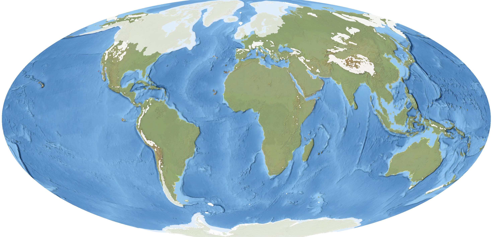
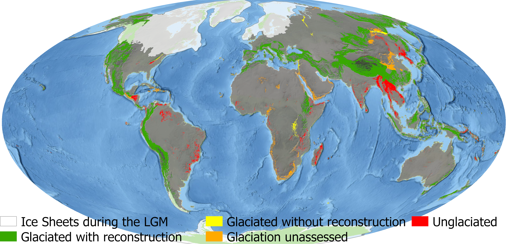

::: {.glacimontis-hero}
::: {.glacimontis-hero-text}

GLACIMONTIS

Mountain Glacier Extents at the Last Glacial Maximum

When and where did mountains host their largest glaciers?

GLACIMONTIS is a global geodatabase of reconstructed mountain paleoglaciers at the Last Glacial Maximum. It brings together glacier reconstructions from the scientific literature into a harmonised, traceable, and open-access spatial dataset.

::: {.button-row}
[Read the paper](https://www.nature.com/articles/s41597-026-06841-z){.btn .btn-primary}
[Behind the Paper](https://communities.springernature.com/posts/mountain-glacier-extents-at-the-last-glacial-maximum){.btn .btn-outline-light}
[Download the database](https://zenodo.org/records/15600659){.btn .btn-outline-light}
:::
:::
:::

::: {.glacimontis-section}

## Overview

Approximately 21,000 years ago, Earth was much colder than today, and glaciers extended far beyond their modern limits. In mountain regions, these former glaciers shaped landscapes, influenced ecosystems, and left behind geomorphological evidence that can still be mapped today.

GLACIMONTIS was developed to bring this scattered knowledge together. Rather than reconstructing glaciers directly from the landscape, the project traced glacier reconstructions through hundreds of studies published across the global literature. The result is a global geodatabase of mountain glacier extents at the global and local Last Glacial Maximum.

:::

::: {.stats-grid}

::: {.stat-card}
### 15,014
Individual glacier reconstructions
:::

::: {.stat-card}
### 209
Scientific studies compiled
:::

::: {.stat-card}
### 271
Mountain ranges assessed
:::

::: {.stat-card}
### 57–14 ka
Timeframe covered
:::
:::

::: {.glacimontis-map}

:::

::: {.glacimontis-section}

## Why GLACIMONTIS?

Mountain glaciers are key archives of past climate and landscape change. Yet, before GLACIMONTIS, reconstructions of former mountain glaciers were scattered across publications, regional datasets, printed maps, supplementary materials, and non-standard geospatial formats.

This made it difficult to compare mountain regions globally, evaluate glacier and climate models, or use paleoglacier extents in ecological and biogeographical studies.

GLACIMONTIS addresses this by providing a global, open-access synthesis of reconstructed mountain glacier extents, while preserving links to the original studies and their interpretations.

:::

::: {.two-column-section}

::: {.text-column}
## The challenge

Compiling GLACIMONTIS was not simply a matter of downloading existing files. Many reconstructions were difficult to access, available only as figures in publications, or stored in formats that required additional processing. In other cases, spatial references, coordinate systems, or metadata were incomplete.

Another challenge was temporal. The Last Glacial Maximum is often treated as a single global interval, but mountain glaciers did not all reach their largest extent at the same time. For this reason, GLACIMONTIS includes both global LGM and local last glacial maximum reconstructions within a broader 57–14 ka timeframe.
:::

::: {.text-column}
## The approach

The project focused on making data heterogeneity traceable rather than erasing it. Each glacier reconstruction is linked to its original source, and the database preserves information about chronology, paleoclimate estimates, equilibrium-line altitude, data availability, and methodological context where available.

This allows users to understand not only where former glaciers were mapped, but also how those reconstructions were produced and how they should be interpreted.
:::

:::

::: {.glacimontis-section}

## What the database contains

GLACIMONTIS includes three main spatial products:

::: {.feature-list}

::: {.feature-item}
### Empirically Reconstructed Paleoglaciers

A compilation of individual glacier reconstructions, organised by source publication and mountain range. This layer preserves the original reconstruction context as much as possible.
:::

::: {.feature-item}
### Filtered Reconstructed Paleoglaciers

A curated, ready-to-use product that merges reconstructions into generalised glacier masks for broad-scale applications, including modelling and comparative analyses.
:::

::: {.feature-item}
### Glaciated Mountain Ranges Overview

A global overview of mountain ranges that were glaciated to some extent during the Last Glacial Maximum. This layer helps identify where empirical reconstructions are available, where glaciation is known but remains unmapped, and where mountain ranges were unglaciated.
:::

:::

The database also includes metadata tables documenting source publications, reconstruction methods, data availability, chronology, ELA information, and paleoclimate values where reported.

:::

::: {.glacimontis-map}

:::

::: {.glacimontis-section}

## Applications

GLACIMONTIS can support research across several fields:

- Paleoclimate reconstruction
- Glacier and climate model evaluation
- Landscape evolution studies
- Mountain biogeography and paleoecology
- Global comparisons of Quaternary mountain glaciation
- Identification of geographic and methodological research gaps

:::

::: {.glacimontis-highlight}

## Behind the project

This work was developed by an interdisciplinary team bringing together expertise in glacial geomorphology, paleoglacier reconstruction, paleoclimate, biogeography, GIS, and mountain landscape change.

The project also reflects the collaborative spirit of the paleoglacier research community. Many researchers shared data, clarified interpretations, and contributed to improving the global synthesis.

:::

::: {.glacimontis-section}

## Citation

Lima, A. C., Dulfer, H. E., Hughes, A. L. C., Margold, M., Barr, I., Laabs, B. J. C., & Flantua, S. G. A.  
**Mountain glacier extents at the Last Glacial Maximum.**  
*Scientific Data* 13, 629 (2026).

::: {.button-row-dark}
[Scientific Data paper](https://www.nature.com/articles/s41597-026-06841-z){.btn .btn-primary}
[Zenodo dataset](https://zenodo.org/records/15600659){.btn .btn-secondary}
[Behind the Paper story](https://communities.springernature.com/posts/mountain-glacier-extents-at-the-last-glacial-maximum){.btn .btn-secondary}
:::

:::
