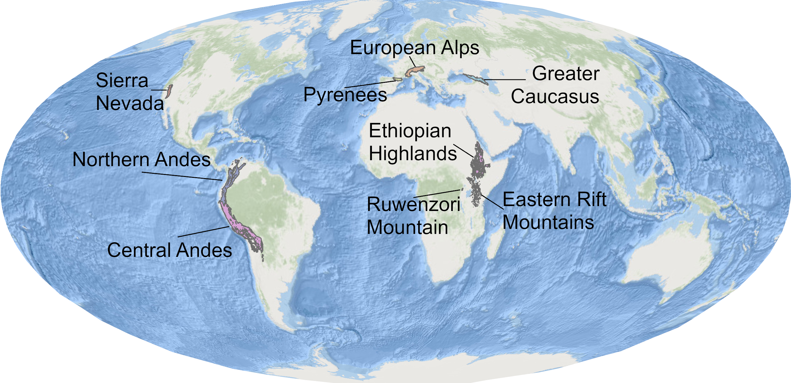
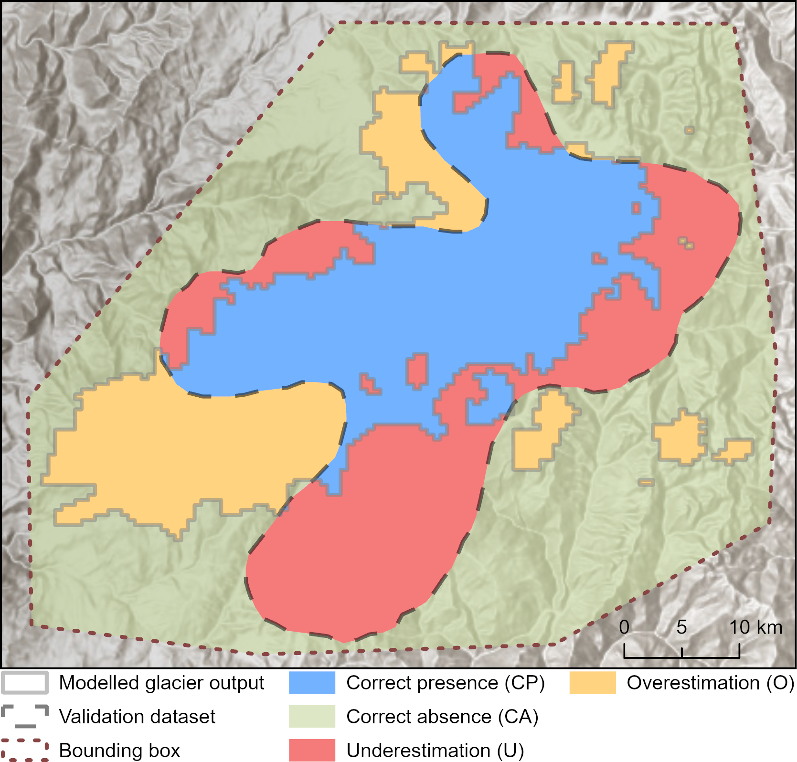
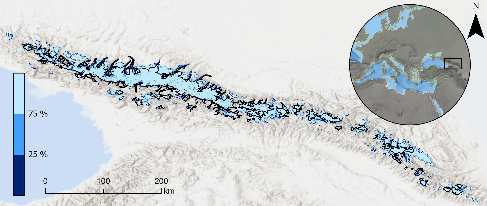

::: {.paleo-hero}
::: {.paleo-hero-inner}

::: {.paleo-hero-text}

Transient Paleoglacier Modelling

Mountain glacier evolution since the last interglacial

This project uses the AI-based **Instructed Glacier Model (IGM)** to simulate mountain glacier evolution across glacial-interglacial timescales. We model glacier extent, ice thickness, and ice-flow evolution since ~130 ka, combining paleoclimate forcing, GPU-accelerated ice dynamics, and spatial validation against empirical glacier reconstructions.

::: {.button-row-dark}
[Project idea](#project-idea){.btn .btn-light}
[Modelling workflow](#modelling-workflow){.btn .btn-outline-light}
[Validation framework](#validation-framework){.btn .btn-outline-light}
:::
:::

:::
:::

::: {.stats-grid}
::: {.stat-card}
### ~130ka
Simulation period
:::

::: {.stat-card}
### 500m
Spatial resolution
:::

::: {.stat-card}
### 14
Simulation domains
:::

::: {.stat-card}
### 617
Calibration experiments
:::
:::

::: {.glacimontis-section #project-idea}

## Project idea

Mountain glaciers are central to understanding past climate, landscape evolution, and alpine ecosystem history. Yet, for many mountain ranges, glacier evolution through the Last Glacial Cycle and the Holocene remains poorly constrained. Existing studies often focus on individual time slices, such as the Last Glacial Maximum or the Younger Dryas, or cover limited spatial domains because high-resolution transient glacier modelling is computationally demanding.

This project addresses that gap by using the **Instructed Glacier Model (IGM)**, a deep-learning ice-flow emulator, to make long-timescale, high-resolution transient simulations feasible across broad mountain regions. Instead of reconstructing only a single glacier maximum, the aim is to model how glaciers expanded, retreated, and reorganised through full glacial-interglacial climate variability.

:::

::: {.two-column-section}

::: {.text-column}
## Why this matters

Transient glacier simulations provide time-varying boundary conditions for research questions that cannot be answered with static glacier maps alone. They help investigate when mountain corridors were glaciated, how valleys were connected or isolated, and how glacier change influenced sediment flux, lake development, geomorphic processes, and alpine biogeography.
:::

::: {.text-column}
## Main innovation

The project combines GPU-accelerated glacier modelling with an explicit ensemble-evaluation strategy. Rather than selecting one visually convincing “best” simulation, the workflow evaluates many plausible simulations and maps where model agreement is robust or sensitive to parameter choices.
:::

:::

::: {.glacimontis-section #study-areas}

## Study areas

The simulations cover eight broad mountain ranges across North America, South America, Eurasia, and Africa, subdivided into 14 simulation domains. The domains include the Northern Andes, Ethiopian Highlands, Eastern Rift Mountains, Ruwenzori Mountains, California Sierra Nevada, Greater Caucasus, Pyrenees, and European Alps.

::: {.paleo-figure}

:::

:::

::: {.glacimontis-section #modelling-workflow}

## Modelling workflow

The modelling workflow links global topography, present-day climatologies, paleoclimate proxy information, ice-flow dynamics, and systematic parameter calibration. This creates a reproducible pipeline for testing how different climate and ice-dynamic assumptions influence simulated glacier evolution.

::: {.feature-list}

::: {.feature-item}
### Ice-free topography

An ice-free digital elevation model is prepared by removing present-day glacier thickness from a global terrain model, producing the bedrock surface used for the simulations.
:::

::: {.feature-item}
### Paleoclimate forcing

Temperature and precipitation are derived from present-day climatologies and adjusted through paleoclimate anomalies, regional scaling factors, lapse-rate corrections, and glacial-index precipitation scaling.
:::

::: {.feature-item}
### Ice dynamics with IGM

The Instructed Glacier Model simulates transient glacier evolution using a physics-informed deep-learning emulator for ice flow, allowing long simulations to be run efficiently on GPUs.
:::

::: {.feature-item}
### Parameter calibration

Temperature scaling, precipitation scaling, melt factors, and sliding parameters are varied across simulation ensembles to explore uncertainty and identify plausible model configurations.
:::
:::
:::

::: {.glacimontis-highlight}

## From single best-fit maps to ensemble probabilities

A major challenge in paleoglacier modelling is **equifinality**: different combinations of climate forcing and ice-dynamic parameters can produce similarly plausible glacier extents. This project treats that uncertainty as part of the result. By ranking simulations and analysing the top-performing ensemble, glacier extent is expressed as a probability surface rather than a single deterministic outline.

:::

::: {.glacimontis-section #validation-framework}

## Validation framework

Modelled glacier extents are validated through spatial comparison against empirical and present-day glacier datasets. For the Last Glacial Maximum, model outputs are compared with GLACIMONTIS glacier reconstructions. For the model present day, glacier outlines and ice volumes are compared with RGI 7.0 and the Farinotti et al. global ice-thickness estimate.

The validation workflow classifies model-data agreement into correct presence, correct absence, underestimation, and overestimation. These classes are then summarised using confusion-matrix scores and the Critical Success Index (CSI), allowing simulations to be ranked quantitatively rather than only judged visually.

::: {.paleo-figure}

:::

:::

::: {.glacimontis-section #probabilistic-outputs}

## Probabilistic glacier reconstructions

The final evaluation step uses the highest-ranked simulations from each ensemble to map how frequently each grid cell becomes ice-covered. Areas covered by ice in more than 75% of acceptable simulations represent robust model agreement. Areas covered in fewer than 25% of acceptable simulations indicate locations where glacier formation depends strongly on parameter choices or uncertain climate forcing.

This creates a spatial uncertainty product that is useful for both paleoclimate interpretation and downstream ecological or geomorphological applications. Instead of presenting past glacier extent as a fixed boundary, the model highlights where the reconstructed glacier landscape is stable, uncertain, or sensitive to forcing assumptions.

::: {.paleo-figure}

:::

:::

::: {.glacimontis-section #my-role}

## My contribution

My contribution focused on synthesising climate scenarios for glacier simulations, supporting model setup, contributing to result analysis, and co-developing the first manuscript draft. This work builds directly on my broader research on GLACIMONTIS and paleoglacier datasets, linking empirical glacier reconstructions with numerical glacier modelling and model validation.

:::

::: {.two-column-section}

::: {.text-column}
## Key outputs

- Transient simulations of mountain glacier evolution since ~130 ka.
- Modelled glacier extent, ice thickness, and surface velocity through time.
- Calibration ensembles exploring paleoclimate and ice-dynamic uncertainty.
- Quantitative validation against LGM and present-day glacier datasets.
- Probability-based maps of robust and uncertain glacier occurrence.
:::

::: {.text-column}
## Paleoglacier evolution animation

The full 130 ka transient simulation can be visualised in an animation that shows how glaciers expanded, retreated, and reorganised through glacial-interglacial climate variability. However, animations are yet not included as publication is in review and such outputs were not made available within the pre-print.
:::

:::

::: {.glacimontis-section #project-status}

## Project status

This page describes an ongoing preprint project. The first manuscript was subimitted to Earth System Science Data (ESSD) Copernicus Publications. The next steps are to address reviewer comments, finalise the manuscript, and prepare the data and code for public release. The project is expected to be published in late 2026 or early 2027. Menwhile, you can cheack the preprint on Zenodo and our poster from the EGU General Assembly 2026.

::: {.button-row}
[Manuscript pre-print](https://zenodo.org/records/18195704){.btn .btn-primary}
[EGU26 Poster](https://meetingorganizer.copernicus.org/EGU26/EGU26-18020.html){.btn .btn-outline-primary}
:::

:::

