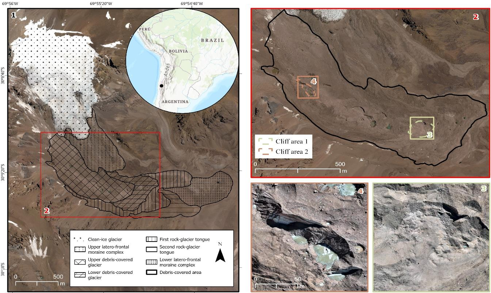
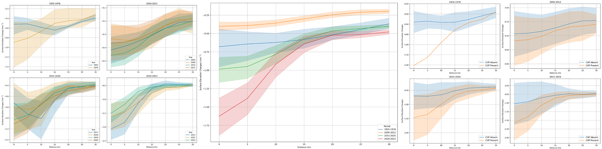
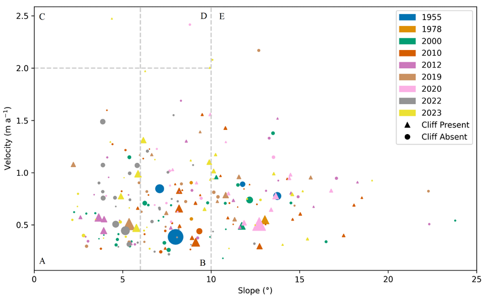
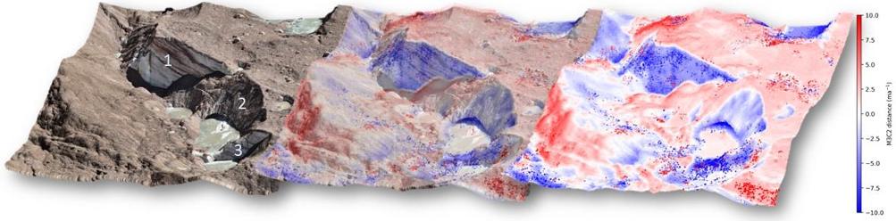
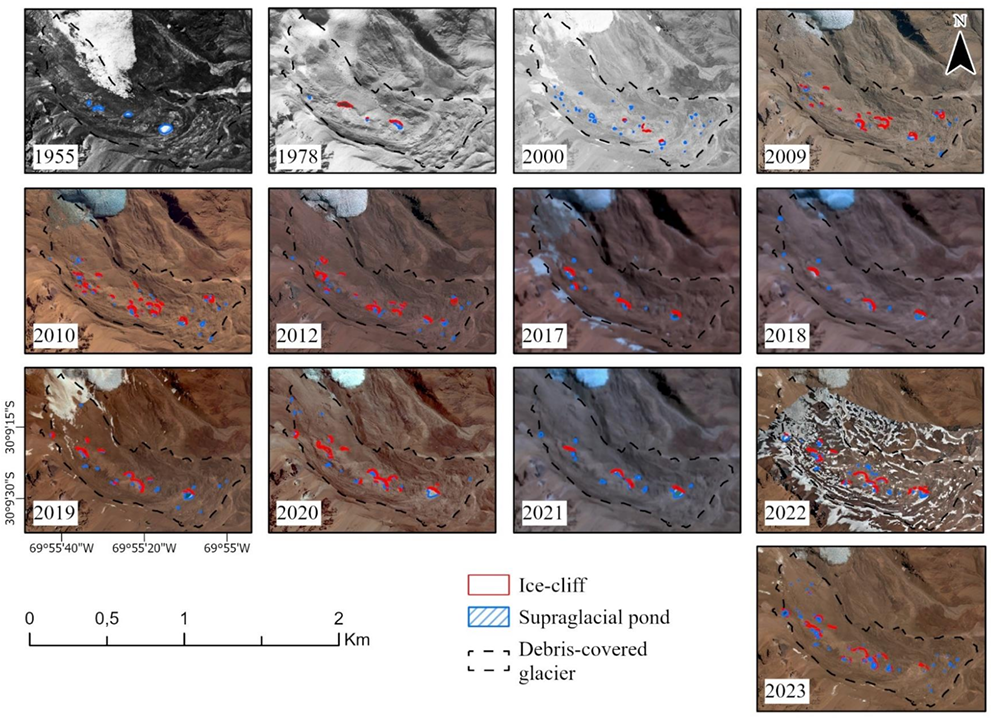

::: {.card}
My master’s thesis explores how supraglacial ponds and ice cliffs influence the melting patterns of Tapado Glacier in the semiarid Andes of Chile. These features, found on the debris-covered surface of the glacier, play a crucial role in how the glacier loses mass. Using a mix of historical aerial imagery, satellite data, and drone-based surveys, I built an inventory of these features from 1956 to 2023. The goal was to understand their distribution, how they form, and, most importantly, how they accelerate ice melt in specific areas.

**Supervised by:** Prof. Benjamin Robson
:::

::: {.center}
{.img-fluid}

::: {.caption}
Location of Tapado Complex and its landforms. The three main landforms discussed include: (1) the Tapado Complex, (2) the upper and lower debris-covered glaciers with ice cliffs in Areas 1 and 2, (3) Area 1’s thermokarst depression from 2019–2020, and (4) Area 2’s cliffed zones surveyed in 2022–2023.
:::
:::

::: {.card}
The results showed that even though ponds and cliffs occupy a relatively small surface area, they have an outsized impact on glacier thinning. For instance, **ice cliffs alone can increase melt rates by more than six times** compared to surrounding areas.
:::

::: {.center}
{.img-fluid}

::: {.caption}
Surface elevation changes related to supraglacial pond and ice cliff formation (5 m bins within a 30 m radius). Left: yearly surface lowering; middle: change per period; right: difference by cliff presence.
:::
:::

::: {.card}
I also found that these features tend to form in areas with **low surface slope** and **slow ice movement**, key insights into why some glacier sectors thin more rapidly than others.
:::

::: {.center}
{.img-fluid}

::: {.caption}
Distribution of supraglacial ponds categorized by cliff presence, survey year, and local ice velocity/slope across the Tapado Complex.
:::
:::

::: {.card}
Importantly, the use of drone technology (UAVs) proved to be a game-changer, offering high-resolution 3D models that captured subtle changes missed by satellite imagery.
:::

::: {.center}
{.img-fluid}

::: {.caption}
M3C2 point cloud distances (2022–2023) for cliffed Area 2. Left panel shows RGB point cloud; right panel shows change in meters.
:::
:::

::: {.card}
This research adds to our understanding of how climate change is affecting high mountain water sources. Tapado Glacier provides meltwater to over 230,000 people downstream, making it a critical resource in a region already facing water scarcity. By highlighting the importance of supraglacial features and the power of UAV-based remote sensing, this thesis offers valuable tools for glacier monitoring and water resource planning in the Andes and beyond.
:::

::: {.center}
{.img-fluid}

::: {.caption}
Inventory of supraglacial ponds and ice cliffs at Tapado Glacier from 1955 to 2023.
:::
:::

# 📬 Contact

::: {.card}
Have questions or want to learn more? Feel free to get in touch or read the full thesis below:

- **Email:** <augusto.naschimento@uib.no>
- **Full master’s thesis:** [Understanding Glacier Melt with Drones](https://bora.uib.no/bora-xmlui/handle/11250/3120974)
:::
