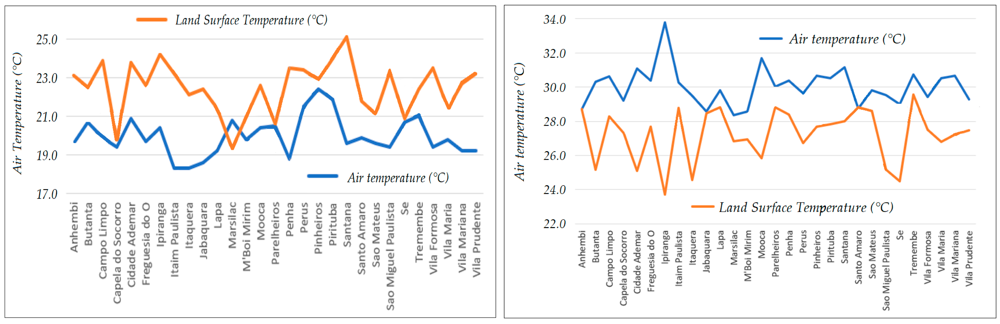

::: {.card}
Our research investigated the relationship between air temperature and land surface temperature (LST) in São Paulo, Brazil, focusing on how urbanization and seasonal variations affect temperature patterns across the city. We used remote sensing data to quantify the urban heat island effect and found substantial temperature differences between urban and rural areas.

Specifically, urban regions experienced temperatures approximately **5.8 to 11.5 °C** warmer than rural areas during spring–summer, and **4.4 to 8.5 °C** warmer during autumn–winter. These results clearly show how urban development significantly influences local climate.
:::

::: {.center}
{.img-fluid}

::: {.caption}
Land Use/Land Cover (LULC) classification of São Paulo on the right. LST thermal mapping during summer (center) and winter (left).
:::
:::

::: {.card}
More importantly, this study demonstrates that remote sensing is a highly effective, affordable, and practical tool for monitoring urban climate conditions. By providing sufficiently precise spatial temperature data, our findings can directly inform urban planning strategies and environmental policies.

Ultimately, this research highlights the importance of integrating remote sensing technology to better manage and mitigate urban heat island effects, especially in growing cities that lack a dense network of weather stations.
:::

::: {.center}
{.img-fluid}

::: {.caption}
Comparison between Air Temperature and Land Surface Temperature during winter (left) and summer (right).
:::
:::

# 📬 Contact

::: {.card}
Have questions or want to learn more? Reach out via email or explore the full publication below:

- **Email:** <augusto.naschimento@uib.no>
- **Full paper:** [Urban Heat Islands: A Comparison of Air and Land Surface Temperature in São Paulo](https://www.mdpi.com/2073-4433/13/3/491)
:::
