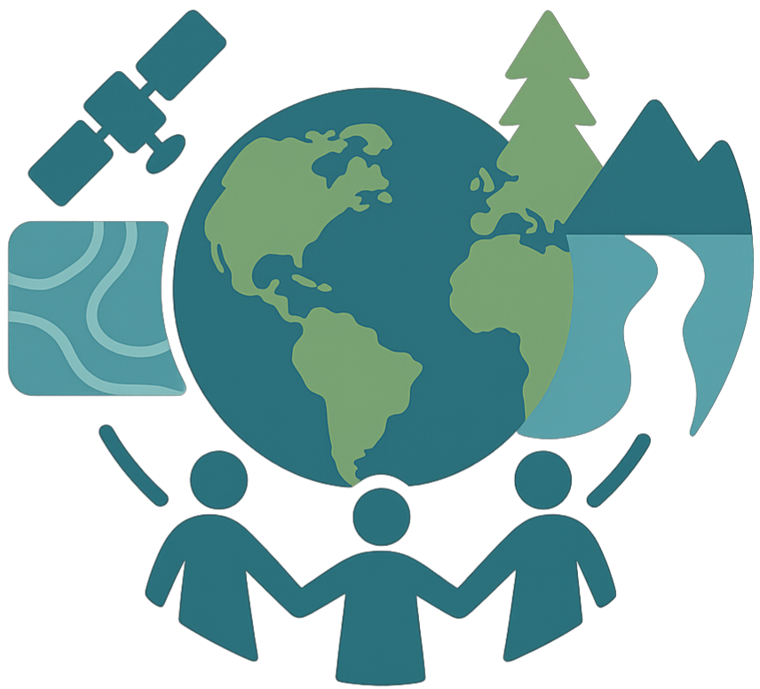
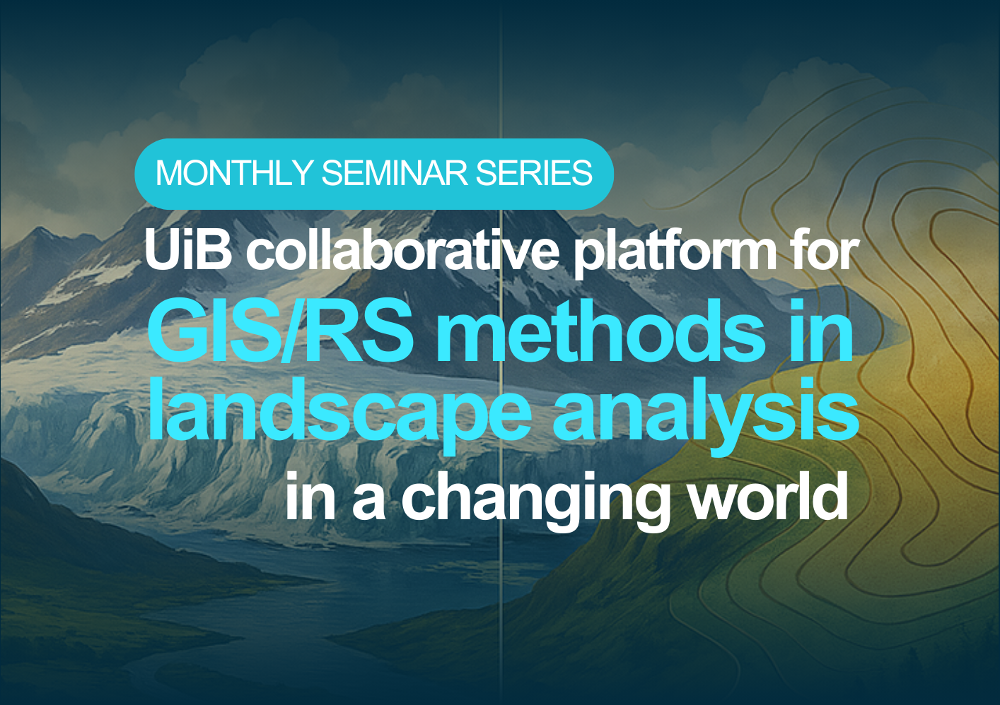
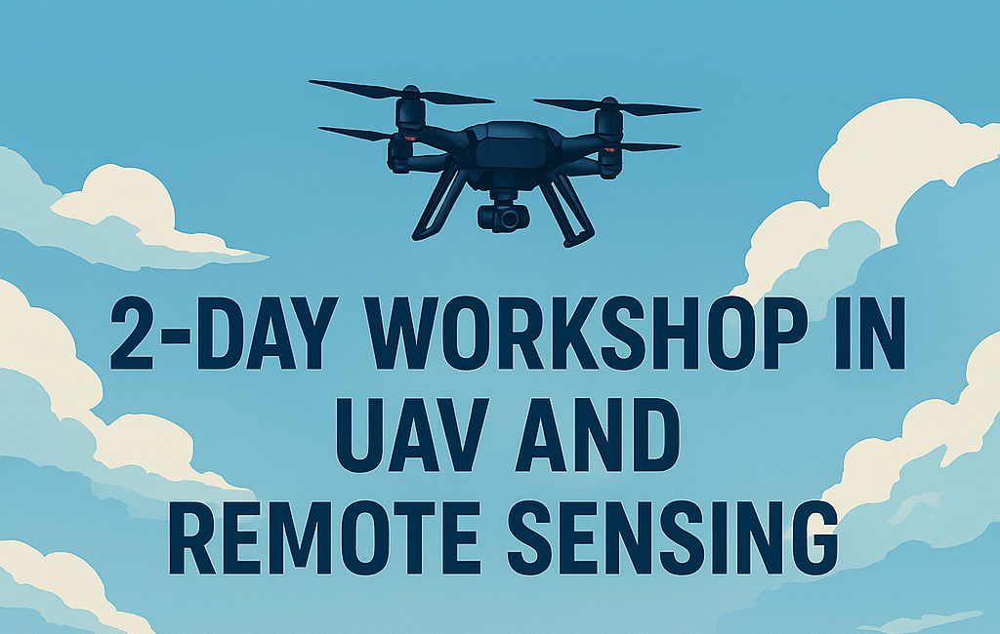
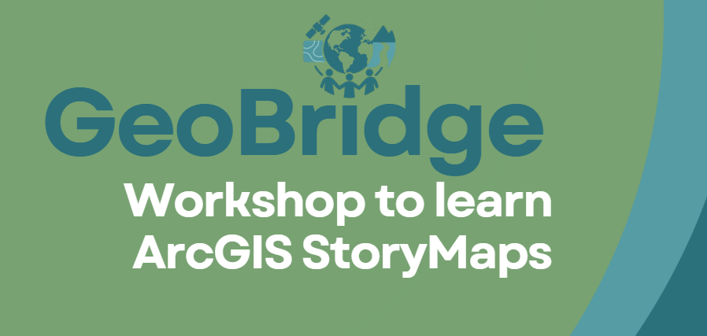

::: {.center}
{width="50%"}
:::

::: {.card}
**GeoBridge** is a collaborative initiative that connects researchers and students from diverse academic backgrounds united by a shared interest in **geographical information systems (GIS)** and **remote sensing (RS)**. The platform fosters knowledge exchange in techniques applied to landscape dynamics in a changing world and aims to support interdisciplinary collaboration, research visibility, and skill development at the interface of the *biosphere*, *geosphere*, and *cryosphere*.
:::

# 🗓️ Activities through 2025 and 2026

::: {.card}
{.img-fluid}

The [GeoBridge Seminar Series](https://mountains-in-motion.github.io/geobridge/seminars.html) is a unique opportunity to engage with researchers and students from UiB, UvA, and global guests on a monthly basis. The seminars focus on spatio-temporal analyses of landscape dynamics across the biosphere, geosphere, and cryosphere, and showcase essential tools for research and real-world problem-solving.
:::

::: {.card}
{.img-fluid}

A hands-on, immersive experience combining UAV fieldwork and geospatial analysis. The [2-Day UAV and Remote Sensing Workshop](https://mountains-in-motion.github.io/geobridge/uavworkshop.html) offers an engaging mix of field missions, data processing, and applied GIS/RS learning. Join researchers, students, and professors for a practical and theoretical deep dive into modern UAV-based landscape analysis.
:::

::: {.card}
{.img-fluid}

As part of the GeoBridge community, we are organized a [two-day hands-on workshop on ArcGIS StoryMaps](https://mountains-in-motion.github.io/geobridge/storymaps.html), a powerful approach for communicating research through interactive maps and visual narratives. The workshop focused on translating spatial analyses into compelling visual narratives, bridging the gap between data, interpretation, and communication. During the workshop, participants learned how to design and build their own StoryMaps using ArcGIS StoryMaps, with a focus on effectively translating spatial analyses into compelling visual narratives.
:::

# 📬 Contact

::: {.card}
For more information, visit the [GeoBridge Website](https://mountains-in-motion.github.io/geobridge/).
:::
